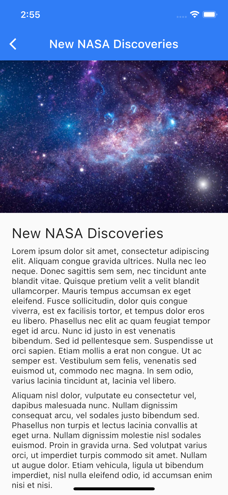

# 📰 MBurger News

Flutter project that shows a list of news, managed from the MBurger platform.

Follow [this](insert_link) tutorial to crete an application like this:

You can create a project in MBurger like this using [this template](template/mburger-news.json):

- Download the template and create a new project from it in [mburger.cloud](mburger.cloud)
- Download this project and change to constants in the `constants.dart` file
- Run the app